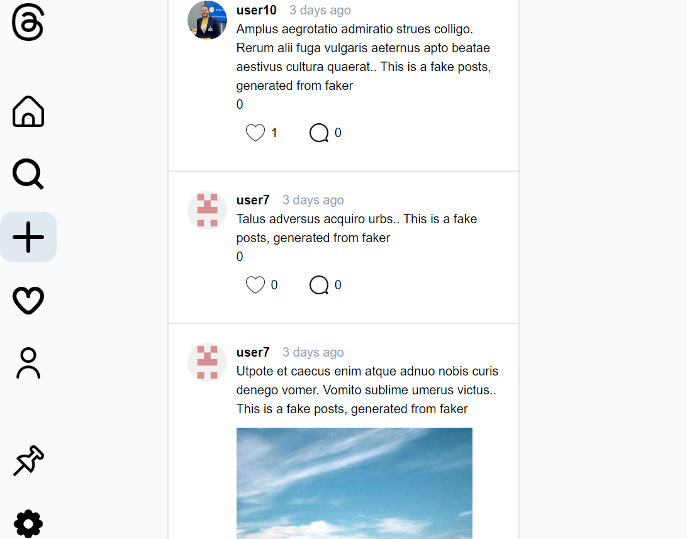

<!-- GETTING STARTED -->
## About MiniThreads

This is a clone of social media website (i.e Threads by Meta). This is part of project along <a href='https://www.theodinproject.com/lessons/node-path-nodejs-odin-book'>TheOdinProject course</a>.

Live DEMO : 
- FrontEnd : https://odin-mini-threads.netlify.app/
- Backend + Database: https://odin-odin-book.onrender.com/

Current feature:
- basic Create & Read of Posts
- basic Create & Read of Comments
- photo upload as post / avatar
- User Auth with Github
- user-following
- post-liking

Tech Stack:
- Front end : Next.js, React, TailwindCSS, shadcn/ui
- Back end : Node Express, PassportJS, Prisma ORM, PostgreSQL, Supabase

Test:
- Backend API : JEST

Repo:
- front end : https://github.com/WongYC-66/odin-mini-threads-FE
- back end : https://github.com/WongYC-66/odin-mini-threads

### Prerequisite:
1. Have postgreSQL and Node installed
2. Register an Outh app at Github, and get CLIENT_ID and CLIENT_SECRET from https://github.com/settings/developers 
3. Register an account at supabase to store uploaded image from https://supabase.com/, to get SUPABASE_PROJECT_URL and SUPABASE_API_KEY 

### Installation BE
1. Clone the backend repo
2. npm install
3. Create .env file like .env-sample
4. Populate fake database by,  npm run resetDB
5. npm run dev
6. [optional] npm run test 

### Installation FE
1. Clone the fronend repo
2. npm install
3. Create .env file like .env-sample, use the same NEXT_PASSWORD
4. modify API_URL to your BE url at /app/lib/apiUrl.js
5. npm run dev
6. visit at http://localhost:3000
